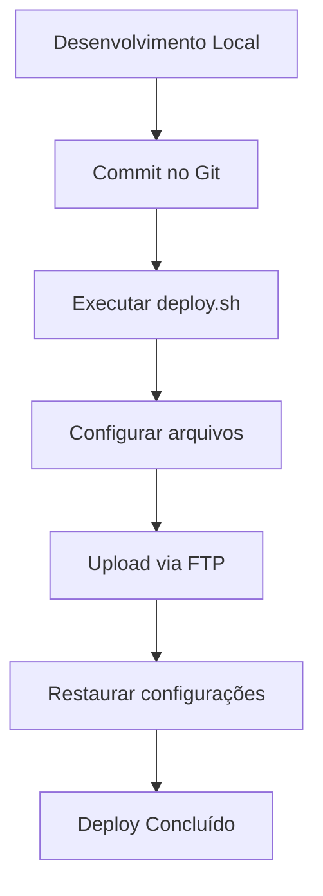

# 🚀 Scripts de Deploy Automático - Preditix

Este conjunto de scripts automatiza o processo de deploy para múltiplos clientes no HostGator, eliminando a necessidade de configurações manuais.

## 📋 Pré-requisitos

### Linux/macOS:
- Bash
- FTP client (opcional)
- Curl (opcional)
- Zip (opcional)

### Windows:
- PowerShell (Windows 10+)
- Arquivo .bat

## 🛠️ Configuração Inicial

### 1. Configurar credenciais FTP (opcional)

```bash
# Copiar arquivo de exemplo
cp env.example .env

# Editar com suas credenciais
nano .env
```

Conteúdo do `.env`:
```env
FTP_USERNAME=seu_usuario_ftp
FTP_PASSWORD=sua_senha_ftp
FTP_HOST=ftp.hostgator.com
```

### 2. Tornar o script executável (Linux/macOS)

```bash
chmod +x deploy.sh
```

## 🚀 Como Usar

### Linux/macOS:

```bash
# Deploy básico
./deploy.sh <cliente> <ambiente>

# Exemplos
./deploy.sh metalmar true
./deploy.sh cliente2 true
./deploy.sh teste false
```

### Windows:

```cmd
# Deploy básico
deploy-windows.bat <cliente> <ambiente>

# Exemplos
deploy-windows.bat metalmar true
deploy-windows.bat cliente2 true
deploy-windows.bat teste false
```

## 📝 Parâmetros

| Parâmetro | Descrição | Valores |
|-----------|-----------|---------|
| `cliente` | Nome da pasta do cliente | `metalmar`, `cliente2`, etc. |
| `ambiente` | Tipo de ambiente | `true` (remoto) ou `false` (local) |

## ⚙️ O que o Script Faz

### 1. **Configurações Automáticas:**
- ✅ Altera `$ambienteIsRemoto` em `config.php`
- ✅ Altera `$base_url` em `header.php`
- ✅ Configura `session_name` corretamente
- ✅ Cria backup dos arquivos originais

### 2. **Upload Automático:**
- ✅ Conecta via FTP ao HostGator
- ✅ Cria pasta do cliente automaticamente
- ✅ Faz upload de todos os arquivos
- ✅ Restaura configurações locais

### 3. **Fallback Manual:**
- ✅ Cria arquivo ZIP se FTP não estiver disponível
- ✅ Fornece instruções detalhadas para upload manual
- ✅ Limpa arquivos temporários

## 🔄 Fluxo de Deploy



## 📁 Estrutura de Arquivos

```
preditix/
├── deploy.sh              # Script principal (Linux/macOS)
├── deploy-windows.bat      # Script para Windows
├── env.example            # Exemplo de configurações
├── .env                   # Configurações FTP (criar)
├── includes/
│   ├── config.php         # Configurado automaticamente
│   └── header.php         # Configurado automaticamente
└── README-DEPLOY.md       # Esta documentação
```

## 🌐 URLs Resultantes

### Ambiente Local:
- URL: `http://localhost/preditix/preditix`
- Configuração: `$ambienteIsRemoto = false`

### Ambiente Remoto:
- URL: `https://seudominio.com/<cliente>`
- Configuração: `$ambienteIsRemoto = true`

## 🛡️ Segurança

### Arquivos Ignorados:
- `.git/` - Controle de versão
- `*.backup` - Backups temporários
- `.env` - Credenciais FTP
- `*.log` - Logs do sistema

### Backup Automático:
- Cria backup antes de modificar arquivos
- Restaura automaticamente em caso de erro
- Remove backups após sucesso

## 🔧 Troubleshooting

### Erro: "FTP não encontrado"
```bash
# Instalar FTP client
sudo apt-get install ftp  # Ubuntu/Debian
brew install ftp          # macOS
```

### Erro: "Permissão negada"
```bash
# Tornar executável
chmod +x deploy.sh
```

### Erro: "Arquivo não encontrado"
```bash
# Verificar se está na pasta correta
pwd
ls -la deploy.sh
```

## 📊 Vantagens

### ✅ **Antes (Manual):**
- ⏱️ 30-45 minutos por deploy
- ❌ Erros manuais frequentes
- 🔄 Processo repetitivo
- 📝 Configurações manuais

### ✅ **Depois (Automático):**
- ⚡ 2-5 minutos por deploy
- ✅ Zero erros de configuração
- 🔄 Processo padronizado
- 📝 Configurações automáticas

## 🎯 Exemplos de Uso

### Deploy para Cliente Metalmar:
```bash
./deploy.sh metalmar true
```

### Deploy para Cliente Teste:
```bash
./deploy.sh teste true
```

### Deploy Local:
```bash
./deploy.sh local false
```

## 📞 Suporte

Em caso de problemas:
1. Verificar se todos os arquivos existem
2. Verificar permissões de execução
3. Verificar credenciais FTP
4. Usar modo manual se necessário

---

**🎉 Deploy automatizado e profissional!**
